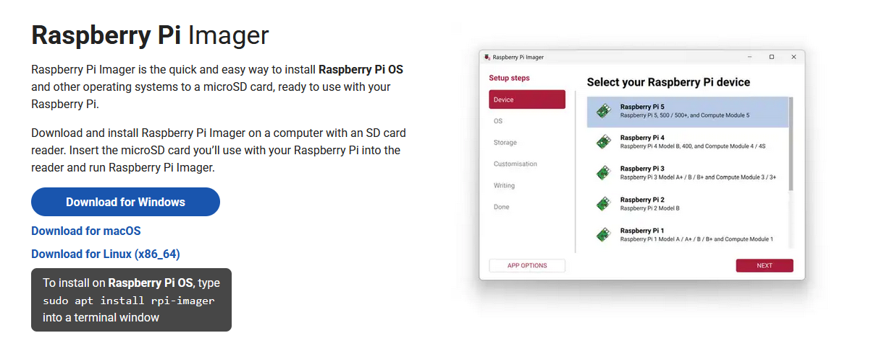
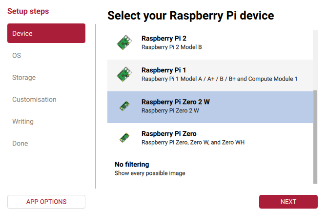
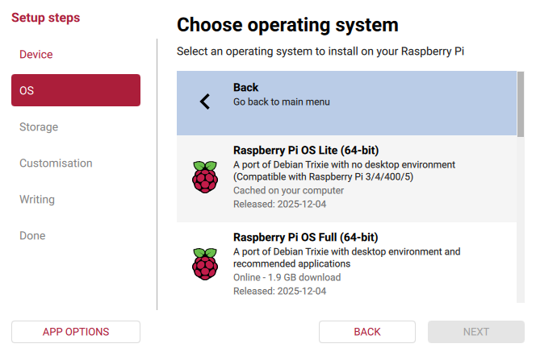
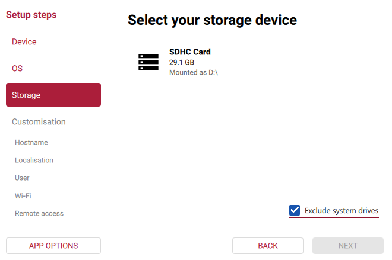
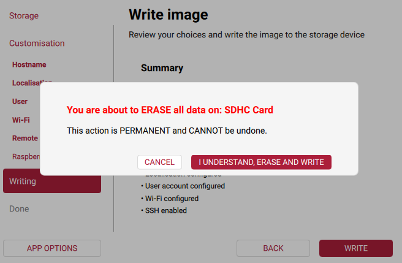
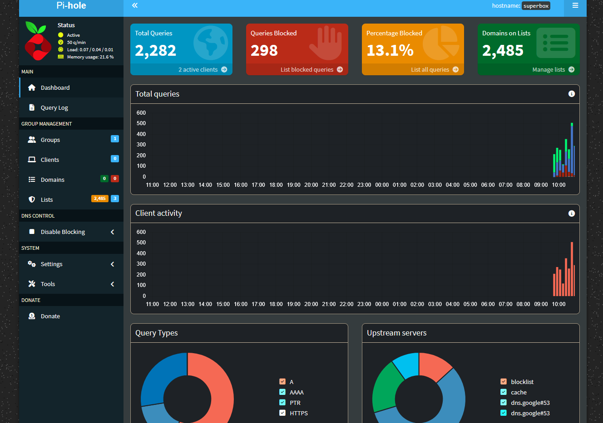
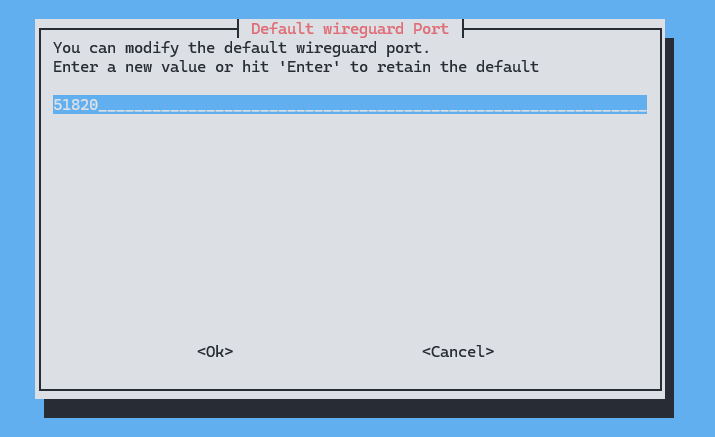
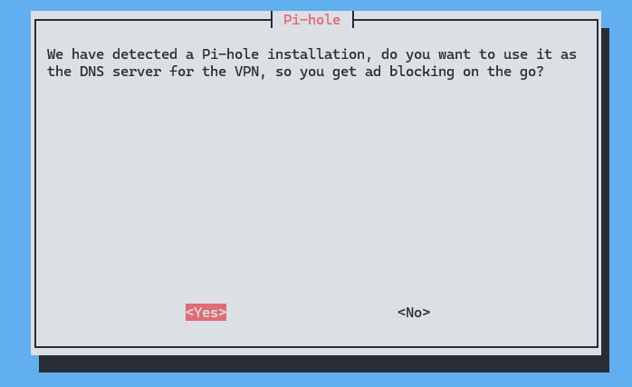
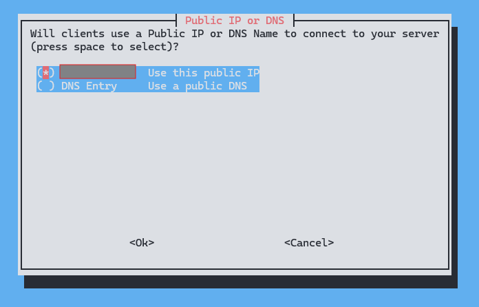
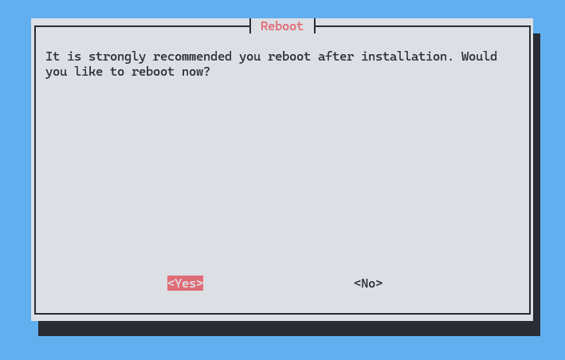

# Pi SuperBox  
**Pi-hole + PiVPN with Self-Monitoring**

Pi SuperBox is a home-network appliance built on a Raspberry Pi Zero 2 W. It blocks unwanted domains, provides a secure way to connect to your home network from anywhere, and includes a small monitoring service that keeps an eye on system health and attempts to fix issues automatically.

## Overview

Pi SuperBox combines Pi-hole (for blocking ads and known bad domains) with PiVPN (WireGuard) to give you a private, encrypted connection into your home network. A monitoring daemon checks whether the connection is working properly, measures basic performance, and restarts or repairs services when something goes wrong.

The system runs fully headless on Raspberry Pi OS Lite (64-bit). Everything is managed through systemd so the services start automatically and recover cleanly after reboots or failures.

## Goals

- Allow secure remote access into your home network.  
- Block potentially malicious traffic and domains at the network level.  
- Automatically detect and correct common service problems.  
- Provide a setup that is easy to reproduce and maintain.  
- Include clear documentation and a structured overview of how everything fits together.
- Build a better understanding of DNS filtering, VPNs, tunneling, networking, Linux administration, and system monitoring.

## System Components

**Hardware:** Raspberry Pi Zero 2 W, 32GB microSD (and SD card reader), wired ethernet (or built-in wifi radio), 2.5A Micro USB Power Supply  
**OS:** Raspberry Pi OS Lite (64-bit, headless)


## Getting started with Pi SuperBox

This README will walk you through:

1. Preparing the Raspberry Pi (OS installation, SSH access, basic security steps)
2. Installing and configuring Pi-hole  
3. Setting up PiVPN (WireGuard) and adding clients

Additional sections cover evaluation results, limitations, possible improvements, and a full source-code appendix.

---

## Preparing the Raspberry Pi

### Pi OS Installation Steps

1. Ensure that the Raspberry Pi is powered off and the microSD card is inserted into your computer, you can check the card's contents using your file manager to ensure it is recognized.
2. Download Raspberry Pi Imager from the **[official website](https://www.raspberrypi.com/software/)**.
<br>
3. Launch the installer and follow the prompts to install Raspberry Pi Imager on your computer.
4. Once installed, please open the Raspberry Pi Imager software and select whichever Raspberry Pi device you are using.
    > **Note:** This guide is optimized for Raspberry Pi Zero 2 W, but other models will likely work as well.

    

    <br>

5. On the software section, scroll down and select "Raspberry Pi OS (other)." Then select "Raspberry Pi OS Lite (64-bit)". 

    

    <br>

6. Choose your microSD card as the storage device, it will likely be listed as SDHC or similar.
    > **Note:** If your microSD card does not appear but is detected within your file manager, try unselecting "Exclude system drives." If you do unselect this option, be very careful when chooosing the storage device to avoid overwriting your computer's main drive.

    

    <br>

7. Select a memorable hostname for your raspberry pi. This will be used to access your device over the network.
8. Create a memorable username and password for your raspberry pi user.
9. If your Raspberry Pi will be connected to the internet via WiFi, configure your wireless settings by entering your SSID and password.
    > **Note:** Ensure that your wireless network has 2.4 GHz support (and that 2.4 GHz mode is ENABLED) as the Raspberry Pi Zero 2 W does not have a 5 GHz radio. You will save yourself a lot of headache if you confirm this before proceeding.

10. Enable SSH access by checking the box next to "Enable SSH" in the "Remote Access" section.
    > **Note:** For security reasons, it is recommended to use SSH keys for authentication instead of passwords. You can set this up later after the initial installation. Also, keeping mind that this will likely be the primary way your access the Pi SuperBox.

11. Once all settings are configured, click the "Write" button to begin the installation process. This will erase all data on the selected microSD card and install Raspberry Pi OS Lite (64-bit).

    
    <br>

12. After the installation is complete, safely eject the microSD card from your computer.
    > **Note:** If you plan on connecting to your Raspberry Pi using a serial connection or using ethernet over USB, **you should ignore step 12**. You will need to enable these features by modifying the `config.txt` and `cmdline.txt` files on the boot partition of the microSD card. Instructions for enabling these features will be provided in the relevant sections below.
    > **Note:** If you need to make any changes to the microSD card after installation (e.g., adding SSH keys), you can reinsert it into your computer and access the boot partition.

## Connecting to Your Raspberry Pi

### Headless Wireless SSH Connection

1. After performing the Pi OS installation steps, insert the microSD card into your Raspberry Pi and power it on.
2. Wait a few minutes for the Raspberry Pi to boot up and connect to your WiFi network.
    > **Note:** If you did not configure WiFi settings during the installation, you will need to connect the Raspberry Pi to a monitor and keyboard to set up WiFi manually, use a wired ethernet connection, or configure ethernet over USB. The easiest method is to reimage the microSD card with the correct WiFi settings. If you want to set up a wired connection, please refer to the _Wired Headless SSH Connection_ or _Wired Headless Serial Connection_ sections below.

3. Connect to your Pi SuperBox via SSH:
    - On MacOS, open a terminal and run:

      ```bash
      ssh <your_pi_username>@<your_pi_hostname>.local
      ```

    - On Linux, first ensure that `avahi-daemon` is installed and running, then open a terminal and begin an SSH session:

      ```bash
      sudo apt install avahi-daemon
      sudo systemctl start avahi-daemon
      ssh <your_pi_username>@<your_pi_hostname>.local
      ```

    - On Windows, ensure that Bonjour is installed (it comes with iTunes or can be installed via [Apple's Bonjour Print Services documentation](https://support.apple.com/en-us/106380)). Then, open PowerShell and begin an SSH session:

      ```powershell
      ssh <your_pi_username>@<your_pi_hostname>.local
      ```

    > **Note:** Replace `<your_pi_username>` and `<your_pi_hostname>` with the username and hostname you either set during the Raspberry Pi OS installation or through the Raspberry Pi Configuration tool.
    >
    > **Note:** If you have trouble connecting via hostname, you can find the Pi's IP address by checking your router's connected devices list or using a network scanning tool like `nmap`. Then, connect using the IP address instead:
    >
    > ```bash
    > ssh <your_pi_username>@<your_pi_ip_address>
    > ```

4. When prompted, enter the password for your Pi user account to complete the SSH connection.
5. If your connection was successful, you should see a terminal prompt indicating that you are logged into your Raspberry Pi. Something like the following:

    ```plaintext
    Linux superbox 6.12.47+rpt-rpi-v8 #1 SMP PREEMPT Debian 1:6.12.47-1+rpt1 (2025-09-16) aarch64

    The programs included with the Debian GNU/Linux system are free software;
    the exact distribution terms for each program are described in the
    individual files in /usr/share/doc/*/copyright.

    Debian GNU/Linux comes with ABSOLUTELY NO WARRANTY, to the extent
    permitted by applicable law.
    Last login: Sat Dec  6 06:35:16 2025 from fe80::2052:d075:6e26:9edb%wlan0
    pi@superbox:~ $
    ```

    The `pi@superbox:~ $` indicates that you are logged in as the `pi` user on a device named `superbox` and are in the `~` (home) directory. From here you can enter commands to control and configure your Pi.
    6. (Optional) For improved security, consider setting up SSH key-based authentication and disabling password authentication. You can follow guides like this one: **[How to Set Up SSH Key-Based Authentication](https://www.ssh.com/academy/ssh/keygen)**.
    7. (Optional) Update your system packages to ensure you have the latest security patches:

      ```bash
      sudo apt update
      sudo apt upgrade -y
      ```

---

## Configuring Pi-hole
> This tutorial follows the **[Pi-hole documentation](https://docs.pi-hole.net/main/basic-install/)**. Please refer to their official documentation for the most up-to-date instructions and additional configuration options.

1. Once you have SSHed into your Raspberry Pi, run the following command to start the Pi-hole installation script:
    > **Note:** This command downloads and runs the Pi-hole installation script directly from the official Pi-hole website. Ensure you trust the source before executing it.
    > **Note:** For any long term application of the Pi SuperBox, it is recommended to set a static IP address for the Raspberry Pi before installing Pi-hole. This can be done by editing the `dhcpcd.conf` file or configuring your router to always assign the same IP address to the Raspberry Pi's MAC address.

   ```bash
   curl -sSL https://install.pi-hole.net | bash
   ```
2. Follow the on-screen prompts in the wizard to configure Pi-hole according to your preferences. Key configuration options include:
   - Selecting the network interface (e.g., `wlan0` for WiFi)
   - Choosing an upstream DNS provider (e.g., Google, Cloudflare, etc.)
   - Configuring blocklists (default lists are usually sufficient)
   - Setting the admin web interface password (a default will be generated)
3. Once the installation is complete, you can access the Pi-hole web interface by navigating to `http://<your_pi_ip_address>/admin` in your web browser.
   > **Note:** Replace `<your_pi_ip_address>` with the actual IP address of your Raspberry Pi.
4. Log in to the web interface using the default password.
5. From the web interface dashboard, you can monitor blocked domains, view statistics, and customize settings as needed!
    > **Note:** Make sure to change the default admin password to something secure and memorable. You can easily do this from the web interface.

    
    <br>
    - Check out the "Lists" section to add or remove blocklists. There are many **[community-maintained lists](https://github.com/hagezi/dns-blocklists?tab=readme-ov-file#pro)** available online that can help improve ad-blocking effectiveness. Whenever you add new lists, make sure to update Pi-hole's gravity database by running (this is what actually applies the changes):

      ```bash
      pihole -g
      ```
    
    - The "Domains" section allows you to whitelist or blacklist specific domains as needed, this can be useful if you find that certain websites are being blocked incorrectly or if you want to block additional domains that are specific to your unique needs.
    - There are also various group management settings that can allow you to create various user groups with different filtering rules. This can be useful if you want to apply different blocking policies to different devices or users on your network.

6. To ensure Pi-hole starts automatically on boot, run the following command:

   ```bash
   sudo systemctl enable pihole-FTL
   ```

7. Finally, update your router's DNS settings to point to the Raspberry Pi's IP address. This will ensure that all devices on your network use Pi-hole for DNS resolution. You can identify your Pi's IP address by running:
    ```bash
    hostname -I
    ```
    > **Note:** The exact steps to change DNS settings vary by router model. Refer to your router's documentation for specific instructions.
    > **Note:** If your router does not allow you to change DNS settings, you can manually configure each device on your network to use the Raspberry Pi's IP address as their DNS server. This may also be useful for running initial tests before affecting your entire network.
    > **Note:** It is critical that you remove any other DNS servers from your router or device settings to ensure that all DNS queries are routed through Pi-hole. Failing to do so may result in some devices bypassing Pi-hole and not benefiting from its ad-blocking capabilities. You should not need a secondary DNS server once Pi-hole is set up and functioning correctly.

8. Test Pi-hole by visiting a website that one of your blocklists should block. I initially used a social media block list and visited `facebook.com` to confirm that Pi-hole was working correctly.
    > **Note:** You can also check the Pi-hole web interface dashboard to see identify specifically what domains are being blocked in real-time.

---

## Configuring PiVPN (WireGuard)
>
> This tutorial follows the **[PiVPN documentation](https://pivpn.io/)**. Please refer to their official documentation for the most up-to-date instructions and additional configuration options.

1. Once you have SSHed into your Raspberry Pi, run the following command to start the PiVPN installation script:
    > **Note:** This command downloads and runs the PiVPN installation script directly from the official PiVPN website. Ensure you trust the source before executing it.

   ```bash
   curl -L https://install.pivpn.io | bash
   ```

2. Follow the on-screen prompts in the wizard to configure PiVPN according to your preferences. Key configuration options include:
    - Modification of the device's IP to a static IP address (if not already set)
    - Modification of DHCP to create a reserved IP range for VPN clients
    - Choosing the VPN protocol **(select WireGuard)**
    - Modification of the default port (if you choose to modify it, ensure that you forward the port on your router to allow external access) 
    
    - Selecting the DNS provider for VPN clients (choose the IP address of your Pi-hole installation to ensure that VPN clients also benefit from your filtering policies)
    
    - Choosing between the public IP or a DNS entry for clients to connect to
        - If you have a static IP, you can use your public IP address directly with no issue.
        - If you have a dynamic IP (most home connections), you should consider using a dynamic DNS service like **[DuckDNS](https://www.duckdns.org/)** or **[No-IP](https://www.noip.com/)** to create a domain name that automatically updates to point to your current IP address. This way, you can always connect to your home network using the same domain name, even when your IP address changes. Explore the options and choose the one that best fits your needs. If you do not, you will have to update your clients every time your public IP changes.
        
    - Choosing whether to enable unattended upgrades for security updates
        - It is highly recommended to enable this option to ensure that your Raspberry Pi receives important security updates automatically.
    
    - Lastly, you will be prompted to reboot your Raspberry Pi to apply the changes.
    

3. After the reboot, you can create a new VPN client profile by running the following command:
    ```bash
    pivpn add
    ```

    > **Note:** If you plan on adding a smartphone as a client, ignore steps 3 and 4. You can generate a QR code to scan with the WireGuard mobile app directly using:
    >
    >```bash
    >pivpn -qr
    >```

    - Follow the prompts to set a name for the client and an optional expiration date.
    - Once the profile is created, the configuration file will be saved in the `/home/<your_pi_username>/configs/` directory.


4. Transfer the configuration file to your client device (e.g., laptop, smartphone) using a secure method something like SCP or a USB drive tend to be safer options.
    > **Note:** Replace `<your_pi_username>` with your actual Raspberry Pi username.

---

## Self-Monitoring Service (Pi Self Monitor)

The Pi SuperBox includes a lightweight monitoring daemon designed to track system health, check the status of both Pi-hole and PiVPN, and make it easier to understand whether your network appliance is functioning correctly. This service provides a simple local dashboard, an API endpoint for automation, and a Prometheus-friendly metrics interface for advanced monitoring setups.

### What the Self-Monitor Does

The monitoring daemon performs several recurring checks:

- **System Status**
  - CPU usage, load averages, memory usage, disk utilization  
  - Raspberry Pi temperature  
  - Device uptime  

- **Pi-hole Status**
  - Confirms whether the `pihole-FTL` service is active  
  - Collects useful DNS statistics (queries, ads blocked, percentages, blocklist size)  

- **PiVPN Status**
  - Detects whether the VPN service is up  
  - Reports connected WireGuard/OpenVPN clients  

All collected data is refreshed continuously and made available through three endpoints:

- **Dashboard:**  
  `http://<your_pi_ip>:8081/`  
  A small HTML interface summarizing all key metrics.

- **JSON Health API:**  
  `http://<your_pi_ip>:8081/health`  
  Ideal for scripts, HomeAssistant, or uptime monitors.

- **Prometheus Metrics:**  
  `http://<your_pi_ip>:8081/metrics`  
  Useful if you want to graph long-term system performance in Grafana.

### Why This Monitor Is Helpful

Running Pi-hole and PiVPN on a compact device like a Raspberry Pi works extremely well—but these services are also **critical infrastructure** for your home network. When something breaks, you want:

- Clear visibility into what failed  
- A quick way to confirm whether DNS filtering is working  
- Immediate insight into VPN availability  
- Metrics you can log or alert on  

The self-monitoring daemon solves this by centralizing all relevant system and service information into one place, making it easy to diagnose issues without digging through logs or running multiple commands manually.

### How to Install the Self-Monitor

A prepared one-line installer is provided so users can deploy the monitoring service without manually copying files or modifying systemd.

Run this on your Raspberry Pi:

```bash
sudo bash <(curl -fsSL https://raw.githubusercontent.com/cloudgy/Pi_Superbox_CSC_321/refs/heads/main/install_pi_self_monitor.sh)
```

## Self-Monitoring Service (Pi Self Monitor)

The Pi SuperBox includes a lightweight monitoring daemon designed to track system health, check the status of both Pi-hole and PiVPN, and make it easier to understand whether your network appliance is functioning correctly. This service provides a simple local dashboard, an API endpoint for automation, and a Prometheus-friendly metrics interface for advanced monitoring setups.

### What the Self-Monitor Does

The monitoring daemon performs several recurring checks:

- **System Status**
  - CPU usage, load averages, memory usage, disk utilization  
  - Raspberry Pi temperature  
  - Device uptime  

- **Pi-hole Status**
  - Confirms whether the `pihole-FTL` service is active  
  - Collects useful DNS statistics (queries, ads blocked, percentages, blocklist size)  

- **PiVPN Status**
  - Detects whether the VPN service is up  
  - Reports connected WireGuard/OpenVPN clients  

All collected data is refreshed continuously and made available through three endpoints:

- **Dashboard:**  
  `http://<your_pi_ip>:8081/`  
  A small HTML interface summarizing all key metrics.

- **JSON Health API:**  
  `http://<your_pi_ip>:8081/health`  
  Ideal for scripts, HomeAssistant, or uptime monitors.

- **Prometheus Metrics:**  
  `http://<your_pi_ip>:8081/metrics`  
  Useful if you want to graph long-term system performance in Grafana.

### Why This Monitor Is Helpful

Running Pi-hole and PiVPN on a compact device like a Raspberry Pi works extremely well—but these services may also be **critical infrastructure** for your home network depending on your application. When something breaks, you want:

- Clear visibility into what failed  
- A quick way to confirm whether DNS filtering is working  
- Immediate insight into VPN availability  
- Metrics you can log or alert on  

The self-monitoring daemon solves this by centralizing all relevant system and service information into one place, making it easy to diagnose issues without digging through logs or running multiple commands manually.

### How to Install the Self-Monitor

A prepared one-line installer is provided so users can deploy the monitoring service without manually copying files or modifying systemd.

Run this on your Raspberry Pi:

```bash
sudo bash <(curl -fsSL https://raw.githubusercontent.com/cloudgy/Pi_Superbox_CSC_321/refs/heads/main/install_pi_self_monitor.sh)
```

### What This Command Does

- `curl -fsSL <url>`
    Downloads the installation script directly from the GitHub repository. The flags used are:
        - -f stops on server errors
        - -s hides progress output
        - -S shows errors if they occur
        - -L follows redirects

- Process substitution `<( ... )`
    Feeds the downloaded script directly into bash without saving it to disk first.

- `sudo bash`
    Runs the script with full root privileges because it must:
        - Install system packages
        - Create /opt/pi-self-monitor/
        - Copy the Python daemon into place
        - Install the systemd service
        - Enable and start the service on boot

Once installed, the daemon launches automatically and immediately begins monitoring your Pi SuperBox.


### Accessing the Dashboard After Installation

Once the install script completes successfully:

- Visit `http://<your_pi_ip>:8081/` in your web browser to see the dashboard.

- Or check service status via:

    ```bash
    sudo systemctl status pi-self-monitor.service
    ```